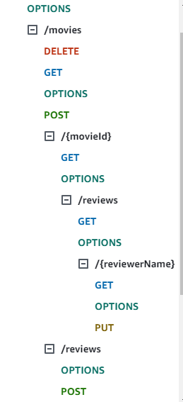
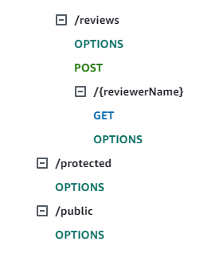
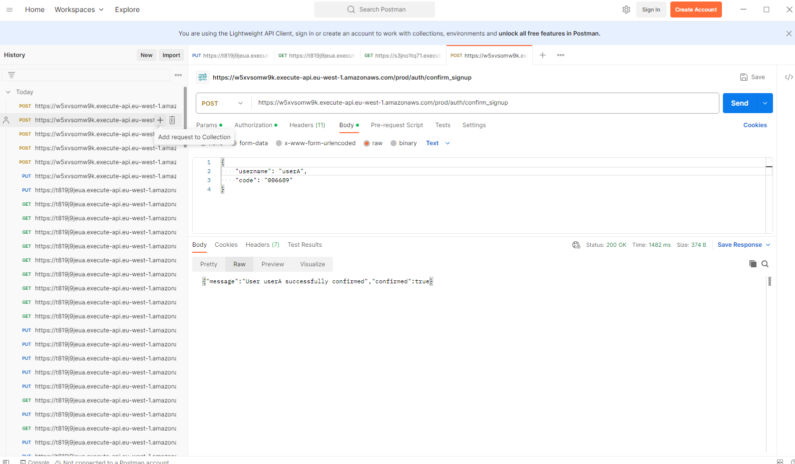
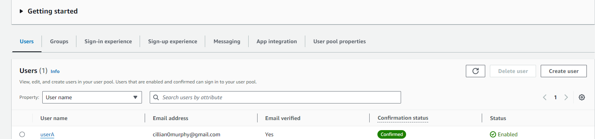

## ServerlessREST Sddignment - Distributed Systems.

__Name:__ Cillian Murphy

This repository contains the implementation of a serverless REST API for the AWS platform. A CDK stack creates the infrastructure. The domain context of the API is movie reviews.

### API endpoints.

[ Provide a bullet-point list of the app's endpoints (excluding the Auth API endpoints).]
e.g.

* POST /movies/reviews - add a movie review.
* GET /movies/{movieId}/reviews - Get all the reviews for a movie with the specified id.
* GET /movies/{movieId}/reviews?minRating=n - Get all the reviews for the movie with the specified ID with a rating greater than the minRating.
* GET /movies/{movieId}/reviews/{reviewerName} - Get the review for the movie with the specified movie ID and written by the named reviewer.
* GET /movies/reviews/{reviewerName} - Get all the reviews written by a specific reviewer.
* PUT /movies/{movieId}/reviews/{reviewerName} - Update the text of a review. (movie ID and reviewer username uniquely identify a review item).

[Include screenshots from the AWS console (API Gateway service) that clearly show the deployed API ( have legible font size). ]

### Authentication..

[Include a screenshot from the AWS console (Cognito User Pools) showing a confirmed user account.]

### Independent learning (If relevant).

State any other evidence of independent learning achieved while completing this assignment.

